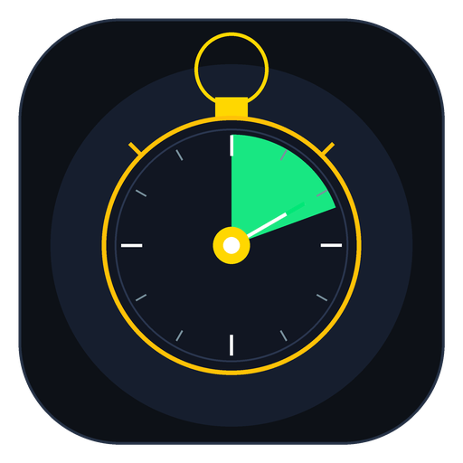
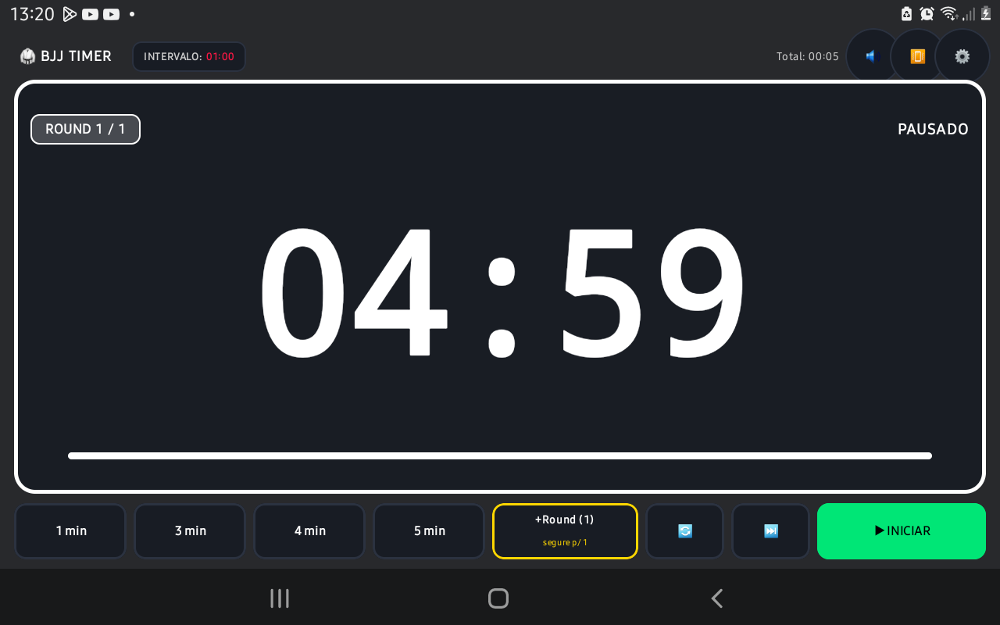
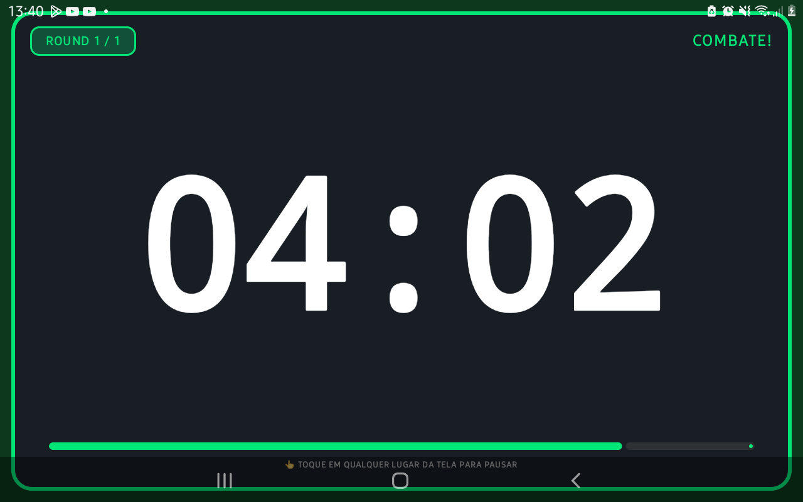
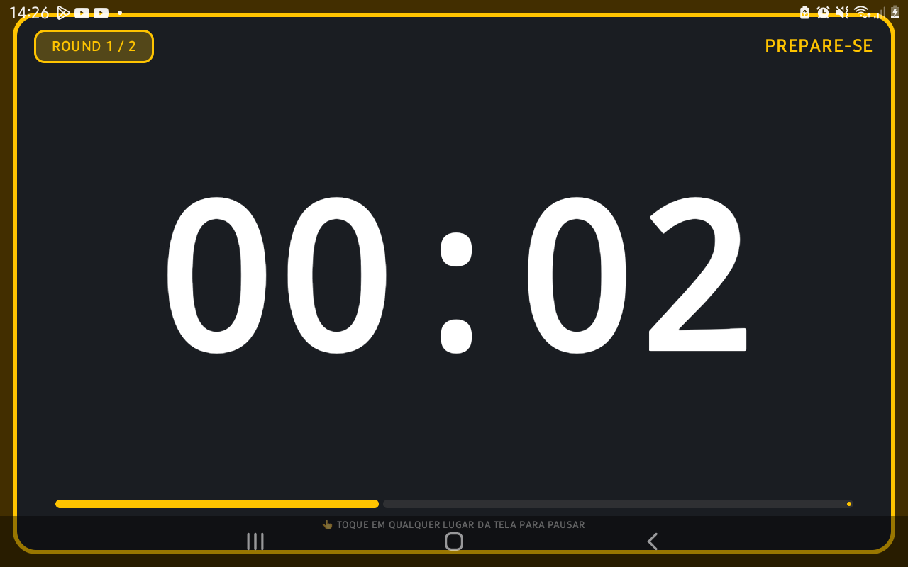
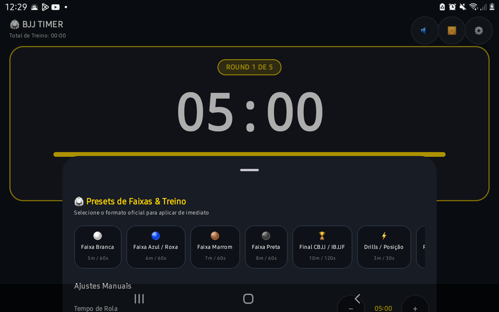

# 🥋 BJJ Timer - Temporizador de Treino de Jiu-Jitsu

Um aplicativo Android moderno, robusto e ultra-visível, projetado especificamente para gerenciar os tempos de rola, combate, intervalos e repetições nos treinos de **Jiu-Jitsu Brasileiro (BJJ)** e artes marciais.

---

## 📸 Demonstração e Capturas de Tela

<p align="center">
  <br/>
  <b>Ícone Oficial BJJ Timer</b>
</p>

| Modo Padrão (Ajustes Rápidos e Rounds) | Modo Full Screen (Combate em Andamento) |
|:---:|:---:|
|  |  |

| Modo Preparação (Âmbar com Beeps) | Configuração de Intervalo entre Rounds |
|:---:|:---:|
|  |  |

---

## 📱 Visão Geral e Experiência de Uso

O **BJJ Timer** foi desenvolvido pensando na dinâmica real do tatame: visualização clara à longa distância, operação rápida com toques diretos e alertas sonoros inconfundíveis para que atletas e professores não precisem se preocupar com o relógio durante o treino.

### ✨ Principais Funcionalidades

1. **🖥️ Orientação Horizontal Fixa (Landscape)**:
   - Interface travada no modo panorâmico, ideal para apoiar o celular ou tablet no chão do tatame, banco ou suporte.

2. **⚡ Botões de Tempo de Rápido Acesso**:
   - Botões pré-definidos de **`1 min`**, **`3 min`**, **`4 min`** e **`5 min`** para ajustar o tempo de rola com apenas um toque.

3. **🔁 Controle Inteligente de Rounds / Repetições**:
   - **Início no 1**: Por padrão, o treino sempre começa configurado no Round 1 (`ROUND 1 / 1`).
   - **Toque Simples**: Incrementa a contagem de repetições (`+Round (2)`, `+Round (3)`...).
   - **Toque Longo (Segurar)**: Reseta instantaneamente o número de rounds de volta para **`1`**.

4. **📺 Modo Full Screen Total (Sobreposição Completa)**:
   - Assim que a contagem inicia, o cronômetro entra em **tela cheia absoluta**, cobrindo o cabeçalho e a barra de botões.
   - Os dígitos ocupam 100% do espaço útil da tela com contraste máximo e barra de progresso viva.

5. **👆 Toque na Tela para Iniciar ou Pausar**:
   - **Iniciar**: Toque em qualquer área do contador central ou no botão `▶ INICIAR`.
   - **Pausar**: Durante a contagem em tela cheia, **basta tocar em qualquer lugar da tela** para pausar imediatamente e retornar ao modo padrão com todos os botões visíveis.
   - **Término Automático**: Ao concluir o último round, o aplicativo fecha a tela cheia automaticamente e restabelece os controles.

6. **⏱️ Intervalo Visível e Ajustável (⚙️)**:
   - Indicador de descanso em destaque contínuo no topo: **`INTERVALO: 01:00`**.
   - Menu de configurações acessível pelo ícone de engrenagem para alterar o descanso entre rounds (**15s, 30s, 45s, 1:00, 1:30, 2:00, 3:00**) ou ajuste manual de segundos.

7. **🔔 Sons Sintetizados Nativos e Vibração**:
   - **Início de Combate**: Sino duplo de ringue (*Ding-Ding*).
   - **Fim de Round / Intervalo**: Buzina grave e estridente de arena (*Buzzer*).
   - **Aviso de 10 Segundos**: Alerta duplo avisando a reta final do rola.
   - **Contagem Regressiva**: Beeps de preparação (*Prepare-se*).
   - *Geração 100% nativa via PCM 16-bit com `AudioTrack`, funcionando totalmente offline sem depender de arquivos de áudio externos.*

8. **💡 Tela Sempre Ligada**:
   - Configurado com `FLAG_KEEP_SCREEN_ON` para garantir que o display nunca desligue ou bloqueie durante o treino.

---

## 🛠️ Arquitetura e Tecnologias

- **Linguagem**: Kotlin 2.3.x
- **UI Framework**: Jetpack Compose com Material 3
- **Design System**: Tema Dark atlético com paleta marcial (Verde Combate, Vermelho Descanso, Âmbar Preparação e Ouro Faixa)
- **Gerenciamento de Estado**: Clean Architecture + MVVM com `TimerViewModel` e `StateFlow`
- **Áudio**: Síntese de ondas senoidais em tempo real (`SoundAlertManager` com `AudioTrack`)
- **Compatibilidade**: Android 8.0 (API 26) até Android 16 (API 36)

---

## 📂 Estrutura do Código-Fonte

```
app/src/main/
├── AndroidManifest.xml          # Permissões (WAKE_LOCK, VIBRATE) e orientação landscape
├── java/com/example/bjjtimer/
│   ├── MainActivity.kt          # Entrada da aplicação e FLAG_KEEP_SCREEN_ON
│   ├── model/
│   │   └── TimerModel.kt        # Estados do timer, fases e configurações
│   ├── audio/
│   │   └── SoundAlertManager.kt # Síntese nativa de sino, buzina e beeps via AudioTrack
│   ├── theme/
│   │   ├── Color.kt             # Paleta de cores marciais
│   │   └── Theme.kt             # Tema Dark permanente para tatame
│   └── ui/
│       ├── TimerViewModel.kt    # Máquina de estados, coroutines de contagem e ações
│       └── TimerScreen.kt       # Interface Compose, modo Full Screen e botões
└── res/                         # Strings, ícones e recursos do Android
```

---

## 🚀 Como Compilar e Instalar

### 1. Requisitos
- Android Studio ou JDK 17+ instalado
- Android SDK instalado

### 2. Compilar APK de Debug
No terminal da raiz do projeto:
```powershell
.\gradlew.bat assembleDebug
```
O arquivo APK gerado estará em:
```
app\build\outputs\apk\debug\app-debug.apk
```

### 3. Rodar Testes Unitários
```powershell
.\gradlew.bat testDebugUnitTest
```

### 4. Instalar Diretamente via USB (ADB)
Com o celular conectado em modo depuração:
```powershell
adb install -r "app\build\outputs\apk\debug\app-debug.apk"
```

---

## 🥋 Oss!
Desenvolvido para levar mais praticidade e foco aos treinos de Jiu-Jitsu Brasileiro.
